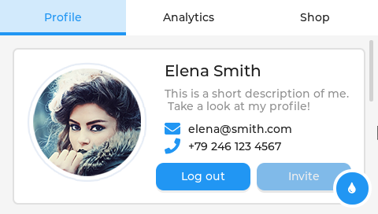
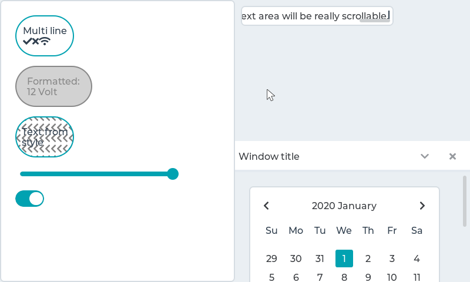

# Demos for LVGL

## Add the examples to your projects
1. demos can be found in the 'demos' folder once you clone the lvgl.

2. In the ***lv_conf.h*** or equivalent places, you can find demo related macros, change its value to enable or disable specified demos:

```c
...
/*===================
 * DEMO USAGE
 ====================*/

/*Show some widget. It might be required to increase `LV_MEM_SIZE` */
#define LV_USE_DEMO_WIDGETS        0
#if LV_USE_DEMO_WIDGETS
#define LV_DEMO_WIDGETS_SLIDESHOW  0
#endif

/*Demonstrate the usage of encoder and keyboard*/
#define LV_USE_DEMO_KEYPAD_AND_ENCODER     0

/*Benchmark your system*/
#define LV_USE_DEMO_BENCHMARK   0

/*Stress test for LVGL*/
#define LV_USE_DEMO_STRESS      0

/*Music player demo*/
#define LV_USE_DEMO_MUSIC       0
#if LV_USE_DEMO_MUSIC
# define LV_DEMO_MUSIC_SQUARE       0
# define LV_DEMO_MUSIC_LANDSCAPE    0
# define LV_DEMO_MUSIC_ROUND        0
# define LV_DEMO_MUSIC_LARGE        0
# define LV_DEMO_MUSIC_AUTO_PLAY    0
#endif

/*Flex layout demo*/
#define LV_USE_DEMO_FLEX_LAYOUT     0

/*Smart-phone like multi-language demo*/
#define LV_USE_DEMO_MULTILANG       0

/*Widget transformation demo*/
#define LV_USE_DEMO_TRANSFORM       0

/*Demonstrate scroll settings*/
#define LV_USE_DEMO_SCROLL          0

/*Define main for 'lv_demos'*/
#define LV_USE_DEMO_MAIN            0

/*Custom 'lv_demos' hal interfaces*/
#define LV_USE_DEMO_HAL_CUSTOM      0
...
```

3. If your development environment or toolchain does not add source files inside '***lvgl***' folder automatically, ensure the `demos` folder is included for compilation.
4. Include "***demos/lv_demos.h***" in your application source file, for example:

```c
//! main.c
#include "lvgl.h"
#include "demos/lv_demos.h"
...
```

## Configure Demos Entry

"demos/lv_demos.c" provides a default implementation of the `main` function, which is enabled by `LV_USE_DEMO_MAIN`. It also depends on the SDL backend by default.

If you enable `LV_USE_DEMO_MAIN` and compile the "demos/lv_demos.c" into an application called `lv_demos`, you can launch the widgets demo by running `lv_demos widgets` and the benchmark demo by running `lv_demos benchmark 1`.

If you need a different backend and looper, you can customize them by enabling `LV_USE_DEMO_HAL_CUSTOM`, and implementing `lv_demos_hal_init_custom`, `lv_demos_hal_deinit_custom` and `lv_demos_run_custom` functions.

If you disable `LV_USE_DEMO_MAIN`, you have the option to use the `lv_demos_create_demo` function to create your main entry for demos. For example:

```c
//! main.c
#include "lvgl.h"
#include "demos/lv_demos.h"

...
lv_disp_t* lv_demos_hal_init_custom(void)
{
    lv_disp_t* disp = NULL;
    lv_tick_set_cb(...);

    ...
    /* TODO: init display and indev */
    ...

    return disp;
}

void lv_demos_hal_deinit_custom(void) { }

void lv_demos_run_custom(void)
{
    while (1) {
        uint32_t delay = lv_timer_handler();
        if (delay < 1) delay = 1;
        usleep(delay * 1000);
    }
}

int main(int argc, char ** argv)
{
#if LV_USE_DEMO_HAL_CUSTOM
    return lv_demos_main_entry(&argv[1], argc - 1);
#else
    lv_init();

    lv_disp_t* disp = lv_demos_hal_init_custom();
    if (disp == NULL) {
        LV_LOG_ERROR("lv_demos initialization failure!");
        return 1;
    }

    if (!lv_demos_create_demo(&argv[1], argc - 1)) {
        goto demo_end;
    }

    lv_demos_run_custom();

demo_end:
    lv_demos_hal_deinit_custom();
    lv_deinit();
    return 0;
#endif
}

```

## Demos

### Widgets
Shows how the widgets look like out of the box using the built-in material theme.

See in [widgets](https://github.com/lvgl/lvgl/tree/master/demos/widgets) folder.



For running this demo properly, please make sure **LV_MEM_SIZE** is at least **38KB** (and **48KB** is recommended):

```c
#define LV_MEME_SIZE    (38ul * 1024ul)
```


### Music player
The music player demo shows what kind of modern, smartphone-like user interfaces can be created on LVGL. It works the best with display with 480x272 or 272x480 resolution.

See in [music](https://github.com/lvgl/lvgl/tree/master/demos/music) folder.


### Keypad and encoder
LVGL allows you to control the widgets with a keypad and/or encoder without a touchpad. This demo shows how to handle buttons, drop-down lists, rollers, sliders, switches, and text inputs without touchpad.
Learn more about the touchpad-less usage of LVGL [here](https://docs.lvgl.io/master/overview/indev.html#keypad-and-encoder).

See in [keypad_encoder](https://github.com/lvgl/lvgl/tree/master/demos/keypad_encoder) folder.


### Benchmark
A demo to measure the performance of LVGL or to compare different settings.
See in [benchmark](https://github.com/lvgl/lvgl/tree/master/demos/benchmark) folder.


### Stress
A stress test for LVGL. It contains a lot of object creation, deletion, animations, style usage, and so on. It can be used if there is any memory corruption during heavy usage or any memory leaks.
See in [stress](https://github.com/lvgl/lvgl/tree/master/demos/stress) folder.


## Contributing
For contribution and coding style guidelines, please refer to the file docs/CONTRIBUTING.md in the main LVGL repo:
  https://github.com/lvgl/lvgl
